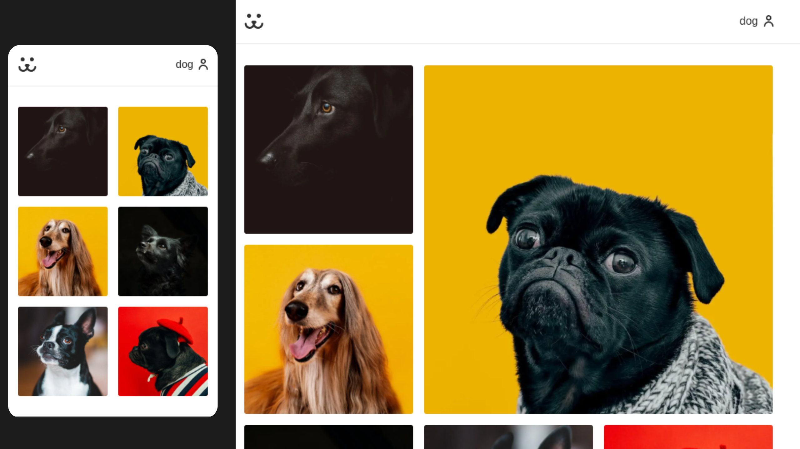
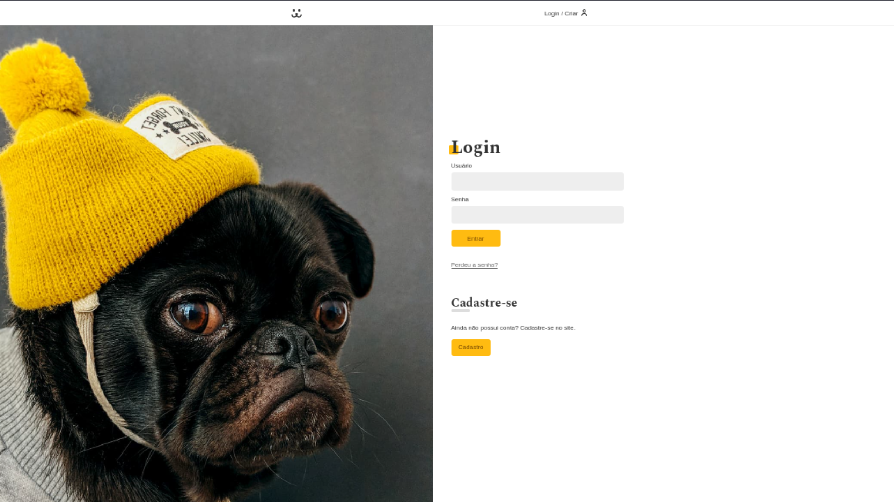

# Dogs Next

## Sobre o Projeto
Dogs Next é uma rede social para cachorros desenvolvida durante o curso de Next.js da Origamid. O projeto é uma versão moderna da aplicação "Dogs" original, reconstruída utilizando Next.js e aproveitando seus recursos de renderização do lado do servidor (SSR), Server Actions, e sistema de roteamento.

## Tecnologias Utilizadas
- Next.js: Framework React com renderização híbrida (SSR, SSG)
- TypeScript: Para tipagem estática
- Server Actions: Para operações do lado do servidor
- API REST: Integração com API externa
- Cookies: Para gerenciamento de autenticação
- Revalidação de Cache: Para manter os dados atualizados

## Funcionalidades
- Autenticação de Usuários: Login, registro e validação de token
- Feed de Fotos: Visualização de fotos postadas por todos os usuários
- Perfil de Usuário: Área do usuário com suas próprias fotos
- Upload de Fotos: Possibilidade de postar fotos de cachorros com informações
- Comentários: Interação através de comentários nas fotos
- Estatísticas: Visualização de estatísticas de acesso às fotos
- Design Responsivo: Interface adaptável para diferentes tamanhos de tela

## Estrutura do Projeto
O projeto é organizado em:

- Actions: Funções do servidor para interações com a API
- Components: Componentes reutilizáveis da interface
- Functions: Utilitários e funções auxiliares
- Hooks: Hooks personalizados para lógica reutilizável

## Como Acessar
Para acessar o sistema, utilize as seguintes credenciais:

    Usuário: dog
    Senha: dog

## Recursos Técnicos Implementados
- Server Actions para operações como login, postagem de fotos e comentários
- Revalidação de cache para manter os dados atualizados
- Proteção de rotas baseada em autenticação
- Gerenciamento de estado do usuário através de cookies
- Tratamento de erros consistente com feedback ao usuário
- Otimização de imagens e carregamento de recursos

## Aprendizados do Curso
Este projeto demonstra a aplicação prática de conceitos modernos do Next.js, incluindo:

- Arquitetura de aplicações com Server Components
- Implementação de autenticação em aplicações Next.js
- Gerenciamento de estado do lado do servidor
- Estratégias de cache e revalidação
- Otimização de performance em aplicações React